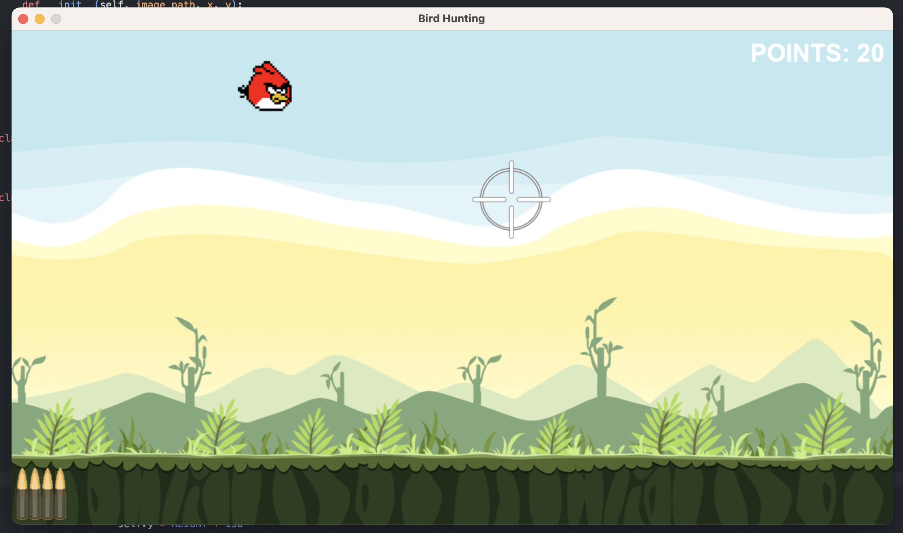

# Bird Hunting Game

Bird Hunting is a simple shooting game developed in Python using Pygame library.

## Features

- **Dog Animation:** A dog character moves up and down periodically on the screen.
- **Bird Movement:** A bird character flies randomly across the screen.
- **Crosshair Control:** Move the crosshair with your mouse to aim.
- **Shooting Mechanism:** Click to shoot at the bird with limited ammunition.
- **Points System:** Earn points for each successful shot.
- **Ammo Management:** Track and reload ammunition after it's depleted.
- **Sound Effects:** Enjoy interactive sound effects for shooting and reloading.

## Requirements

- Python 3.x
- Pygame library

## Installation

1. Clone the repository:

   ```bash
   git clone https://github.com/OsmanTunahan/BirdHunt.git
   cd BirdHunt
   ```

2. Install the required dependencies:

   ```bash
   pip install pygame
   ```

## How to Play

- Run the game:

  ```bash
  python main.py
  ```

- Use your mouse to move the crosshair.
- Click to shoot at the bird.
- Track your points displayed on the screen.
- Reload ammunition when empty by waiting for the reload indicator.

## Controls

- Mouse Movement: Move crosshair
- Left Mouse Button: Shoot

## Images from the game


## Star History

[](https://star-history.com/#OsmanTunahan/BirdHunt&Date)

## Acknowledgements

This game was created by [@OsmanTunahan](https://github.com/OsmanTunahan). Feel free to contribute, report issues, or suggest improvements by opening an issue or pull request on GitHub.